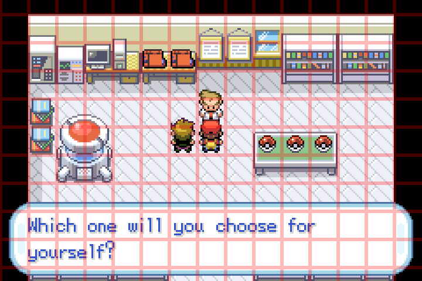

# AI Plays Pokemon

> A vision-only AI agent that plays Pokemon FireRed by looking at the screen — no RAM reads, no memory peeking, no privileged emulator access.



> 🎥 **Demo video coming soon.** I'll embed it here when filmed.

## What makes this different

Most "LLM plays Pokemon" projects read the game's RAM directly to extract player coordinates, party state, map data, and HP values, then feed that to the model as text. That's "an LLM that plays Pokemon with privileged access to game internals."

This project takes the opposite approach: **the agent gets only what a human player would see — the screen.** No reading game memory. No emulator state APIs. No coordinate lookups. If a human couldn't know it from looking, the agent can't either.

That constraint forces real perception work. The harness is also **game-agnostic** — Pokemon FireRed is the first target, but the architecture (vision pipeline, free-form state, task system, turn loop) doesn't hardcode game-specific knowledge in code. Game knowledge lives in prompts and agent-managed state, not in the harness.

## How it compares

| Project | Emulator | RAM reading | Vision | Game-agnostic |
|---|---|---|---|---|
| downthecrop/pokemon-llm | mGBA + Lua | Heavy | Direct multimodal | No (Red hardcoded) |
| martoast/LLM-Pokemon-Red | mGBA + Lua | Yes (coords, map) | Direct multimodal | No |
| cicero225/llm_pokemon_scaffold | PyBoy | Heavy | Direct multimodal | No |
| CalebDeLeeuw/PokemonLLMAgentBenchmark | PyBoy | Heavy | Effectively none | No |
| **This project** | **mGBA + Lua** | **None** | **Direct multimodal + OCR** | **Yes** |

Detailed comparison: [`docs/analysis/compiled_summary.md`](docs/analysis/compiled_summary.md).

## Architecture

```
src/
├── agent/
│   ├── agent.py             # Pydantic AI agent + GameAction output schema
│   └── turn.py              # Turn manager: VLM → LLM → execute loop
├── core/
│   ├── logger.py            # Per-run event logging (events.jsonl)
│   ├── state.py             # Agent's persistent JSON memory
│   ├── snapshots.py         # Save/restore game + agent state
│   ├── prompts.py           # Prompt template substitution
│   └── patches.py           # Pydantic-AI patches for OpenRouter cost extraction
├── emulator/
│   ├── emulator.py          # TCP socket client to mGBA (screenshots, buttons)
│   ├── vision.py            # VLM screen analysis
│   └── ocr.py               # Background Tesseract + LLM cleanup
├── dashboard/
│   ├── server.py            # FastAPI + WebSocket API; serves the SPA
│   └── web/                 # Svelte SPA (the control-center UI; built to web/dist/)
└── cli/
    ├── main.py              # `pokemon` console-script dispatcher
    ├── app.py               # `pokemon app` — long-lived control center (UI + queue)
    ├── runner.py            # `pokemon run` — single or sequential agent runs
    ├── launch.py            # `pokemon launch` — manual mGBA + Lua session
    ├── snapshot.py          # `pokemon snapshot` — snapshot save/load/list
    └── slots.py             # Per-slot mGBA + TCP port assignment
```

**LLM access:** all model calls go through [OpenRouter](https://openrouter.ai), so any frontier model (Gemini, Claude, GPT, Kimi, DeepSeek, Qwen, etc.) can be swapped in via config without code changes. Built with [Pydantic AI](https://github.com/pydantic/pydantic-ai).

## Prerequisites

### 1. mGBA emulator

```bash
# macOS
brew install mgba

# Ubuntu/Debian
sudo apt install mgba-qt

# Other: download from https://mgba.io
```

### 2. Pokemon FireRed ROM

You need a `.gba` ROM file for **Pokemon FireRed (USA, Europe, Rev 1)** placed at `roms/<filename>.gba`. The `roms/` directory is gitignored.

> ⚠️ **Legal note**: ROMs are copyrighted. The only legal way to obtain one is to **dump it yourself from a cartridge you own**, using a flashcart or GBA dumper. This project does not provide, link to, or guide on obtaining ROMs from elsewhere.

### 3. Python 3.11+

```bash
python --version  # should be 3.11 or higher
```

### 4. Tesseract OCR

Used for in-game text extraction.

```bash
# macOS
brew install tesseract

# Ubuntu/Debian
sudo apt install tesseract-ocr
```

### 5. OpenRouter API key

Sign up at [openrouter.ai/keys](https://openrouter.ai/keys).

## Setup

```bash
# Clone
git clone https://github.com/<your-fork>/ai-plays-pokemon.git
cd ai-plays-pokemon

# Drop your ROM into roms/ (gitignored)
cp /path/to/your/firered.gba "roms/Pokemon - FireRed Version (USA, Europe) (Rev 1).gba"

# Python environment
python -m venv venv
source venv/bin/activate
pip install -r requirements.txt

# Install the `pokemon` CLI (editable install — picks up local edits)
pip install -e .

# API key
cp .env.example .env
# Edit .env and add your OPENROUTER_API_KEY
```

## Running it

### Recommended: the control center

```bash
pokemon app
```

The control center is one long-lived process that owns the emulator, a run
queue, and the full web UI. It launches mGBA for you and prints **the one manual
step** — in the mGBA **Scripting** window: **File → Load recent script →
`socketserver-1.lua`**. (That connects the Lua bridge on TCP `127.0.0.1:8888`.)
Then it opens <http://localhost:3420/>, where you:

- **queue runs** — *official* (the frozen benchmark — just pick a model) or
  *casual* (pick model + config + max-turns),
- **watch live** in a fit-to-screen `/spectate` view (game frame, current task,
  agent memory, live reasoning/trace, gate ladder, cost),
- **continue** a finished run from its latest savepoint,
- **browse history** and the **leaderboard** — each run's report renders natively
  (KPIs, gate scorecard, full master→player trace).

Full guide: [`docs/control-center.md`](docs/control-center.md). The benchmark
itself — the referee, the gate ladder, official vs casual, scoring — is in
[`docs/benchmark.md`](docs/benchmark.md).

### Alternative: a one-off scripted run

`pokemon run` is the standalone path — no UI, no queue. It launches its own mGBA,
runs one or more `(config, model)` pairs, and exits:

```bash
# Single run — latest config, one model, default 10 turns
pokemon run --model "gemini-3.5-flash(medium)"

# Pin a specific config + number of turns
pokemon run --config configs/config-3.13.yaml --model "claude-opus-4.7(medium)" --turns 50

# Fan-out: one config across N models, sequential, sharing one mGBA
pokemon run --config configs/config-3.13.yaml \
            --model "gemini-3.5-flash(medium)" "claude-opus-4.7(medium)" --turns 50

# Continue a prior run from its latest savepoint (fresh turn counter + history)
pokemon run --continue local/runs/2026-05-26_..._config-3.13__claude-opus-4-7 --turns 30
```

It also launches mGBA and waits for the same `socketserver-1.lua` handshake.
Model aliases come from `configs/models.yaml`; raw `"provider/model"` ids work
too. Run output lands in `local/runs/<timestamp>/` (gitignored). Full flag
reference, pairing rules, and savepoint/continue semantics:
[`docs/cli.md`](docs/cli.md).

## Configuration

Configs live in `configs/` as versioned files (`config-X.Y.yaml`). Each one is a complete snapshot — model, prompts, OCR settings, screen-stability tuning, the works. Latest version auto-selected by default.

| Setting | What it does |
|---|---|
| `llm_model` | OpenRouter model alias (resolved via `configs/models.yaml`) |
| `vlm_model` | Optional separate VLM (only if `vision_mode: separate_vlm`) |
| `thinking.effort` | `low` / `medium` / `high` for extended thinking |
| `screenshot.grid_overlay` | Red tile grid on agent screenshots — helps spatial reasoning |
| `ocr.*` | Background OCR pipeline (Tesseract + LLM cleanup) settings |
| `vision_mode` | `direct_multimodal` (LLM sees pixels) or `separate_vlm` (VLM → text → LLM) |

The system prompt for each version lives inline in the config file. To experiment, copy the latest config to a new version (e.g. `config-3.14.yaml`) and edit there.

## Documentation

| Doc | What's in it |
|---|---|
| [`docs/control-center.md`](docs/control-center.md) | The `pokemon app` control center — architecture, boot, the web UI (spectate / history / leaderboard), the queue, continue, cooperative stop, run output. |
| [`docs/benchmark.md`](docs/benchmark.md) | PokeBench — the referee, the FireRed gate ladder, official vs casual runs, scoring + leaderboard, and the TaskMaster + Player agent loop. |
| [`docs/cli.md`](docs/cli.md) | Full CLI reference for every `pokemon` subcommand (`app`, `run`, `launch`, `snapshot`), flags, pairing rules, savepoints. |
| [`docs/analysis/`](docs/analysis/) | Deep-dives on other LLM-plays-Pokemon projects (background reading). |

> `docs/build_plan.md` and `docs/initial_ideas.md` are kept as historical
> design/genesis documents — they record the original plan, not the current API.

## Project structure notes

- `local/` — runtime data (runs, snapshots, agent state, the run index + queue). Gitignored.
- `roms/` — your ROM files. Gitignored.
- `CHANGELOG.md` — running log of session-by-session evolution.

## License

MIT
